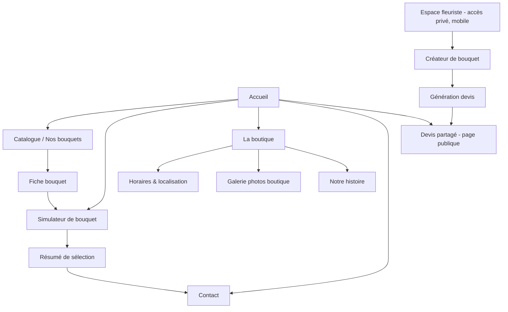
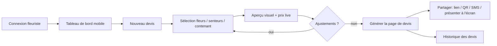

# Cahier des charges — Site web boutique de fleurs

**Version :** 1.0
**Date :** 02/08/2026
**Rédigé par :** Claude (assistant produit) pour le compte du client
**Statut :** Draft pour validation

---

## 1. Contexte et objectifs

La boutique est un fleuriste de quartier dont le modèle économique repose peu sur le stock permanent (rayonnage classique) et beaucoup sur la **composition sur mesure** : le client choisit ou décrit une envie, la fleuriste compose avec les fleurs du moment. Le site doit donc remplir trois rôles bien distincts, qui correspondent à trois publics :

| # | Objectif | Public | Priorité |
|---|----------|--------|----------|
| 1 | Vitrine pratique (horaires, contact, localisation, réseaux sociaux, photos) | Client final | Indispensable dès J1 |
| 2 | Catalogue visuel & simulateur de bouquets | Client final | Cœur de produit |
| 3 | Outil de création mobile pour la fleuriste → devis instantané partageable | Fleuriste (usage interne) | Cœur de produit |

**Principe directeur :** le site n'est pas un e-commerce classique avec panier et stock figé. C'est un **outil de mise en relation et de configuration visuelle**, qui aboutit soit à une prise de contact (appel, message, passage boutique), soit à un devis chiffré généré par la fleuriste elle-même. On n'implémente **pas** de paiement en ligne ni de gestion de stock temps réel dès le lancement — cela vient en étape 2, en option.

### Non-objectifs (hors périmètre V1)
- Paiement en ligne / panier e-commerce classique.
- Livraison automatisée avec créneaux type Uber.
- Compte client avec historique de commandes (peut venir plus tard).
- Multi-boutiques / multi-fleuristes.

---

## 2. Personas

**Client (Camille, 32 ans)**
Cherche un fleuriste de confiance près de chez elle. Veut voir des exemples concrets de bouquets, avoir une fourchette de prix, et pouvoir soit commander en ligne un bouquet "type", soit décrire une envie personnalisée et obtenir une réponse rapide.

**Fleuriste (Sophie, propriétaire)**
Peu de temps, travaille debout dans sa boutique, souvent avec les mains occupées. A besoin d'un outil **mobile, rapide, à faible friction** pour composer un bouquet devant le client (ou entre deux commandes) et lui envoyer un devis visuel en moins de 2 minutes, sans repasser par un logiciel de caisse complexe.

---

## 3. Architecture du site (sitemap)



### 3.1 Détail des pages publiques

| Page | Contenu | Priorité |
|---|---|---|
| **Accueil** | Photo/vidéo hero de la boutique, mise en avant de 4-6 bouquets phares, horaires résumés, bouton "Composer mon bouquet", accès rapide réseaux sociaux/téléphone | V1 |
| **Catalogue / Nos bouquets** | Grille visuelle de bouquets (styles, occasions, gammes de prix), filtrable par occasion (mariage, anniversaire, deuil, romantique...), couleur dominante, budget | V1 |
| **Fiche bouquet** | Photo(s), description, fleurs principales utilisées, fourchette de prix, tailles disponibles, bouton "Personnaliser ce bouquet" → renvoie au simulateur pré-rempli | V1 |
| **Simulateur de bouquet** | Voir §5 | V1 (simple) → V2 (avancé) |
| **La boutique** | Horaires d'ouverture, adresse + carte, galerie photos de la boutique et de l'équipe, présentation courte | V1 |
| **Contact** | Téléphone cliquable, formulaire simple (nom, tél/email, message, pièce jointe optionnelle), liens réseaux sociaux, lien WhatsApp si utilisé | V1 |
| **Page devis partagée** | Page publique générée à la volée par l'outil fleuriste (voir §6), consultable via lien unique, non indexée | V1 |
| **Mentions légales / CGV** | Obligatoire légalement (identité entreprise, hébergeur, données personnelles) | V1 |

### 3.2 Navigation
- Header sticky : Logo · Accueil · Bouquets · La boutique · Contact · CTA "Composer mon bouquet" (bouton accentué) · Téléphone cliquable visible en permanence sur mobile.
- Footer : horaires, adresse, réseaux sociaux, mentions légales, lien vers Google Maps / avis Google.

---

## 4. Spécifications fonctionnelles — Informations pratiques (Objectif 1)

- **Horaires** : affichés en clair sur Accueil, Boutique et Footer, avec indicateur "Ouvert / Fermé actuellement" calculé côté client à partir des horaires configurés en back-office.
- **Téléphone** : lien `tel:` cliquable partout, visible en un tap sur mobile (bouton flottant possible).
- **Réseaux sociaux** : icônes Instagram/Facebook/TikTok avec flux Instagram intégré (widget) sur l'accueil pour montrer les dernières réalisations sans effort de maintenance manuelle.
- **Photos boutique** : galerie responsive (façade, intérieur, ateliers, équipe) — objectif : donner confiance et donner envie de passer en boutique.
- **Localisation** : carte interactive (le repo actuel utilise déjà Leaflet — réutilisable), lien "Itinéraire" vers Google Maps/Waze.

---

## 5. Catalogue visuel & simulateur de bouquets (Objectif 2 — cœur de produit)

### 5.1 Étape 1 — Catalogue de base + simulateur simple

**Catalogue :**
- Bibliothèque de bouquets "modèles" (photos réelles prises par la fleuriste), chacun avec : nom, occasion(s), 3-5 tags de fleurs principales, gamme de prix (ex. "45-60€"), taille (petit/moyen/grand).
- Filtres simples : occasion, budget, couleur dominante.
- Pas de gestion de stock réel — les bouquets catalogue sont des **exemples de style**, pas des produits figés en stock.

**Simulateur simple (V1) :**
- Le client part d'un bouquet du catalogue **ou** démarre de zéro.
- Choix guidés, non granulaires fleur par fleur :
  - Occasion
  - Palette de couleurs (3-4 choix visuels : pastel, vif, blanc/vert, automnal...)
  - Taille / budget (3 paliers : "Petite attention" / "Classique" / "Signature")
  - Message personnalisé optionnel
- Résultat : un visuel indicatif (photo d'un bouquet similaire du catalogue le plus proche des critères, pas de génération d'image réelle) + fourchette de prix.
- Pas de calcul exact fleur par fleur à ce stade — c'est un **pré-qualificateur de demande**.
- CTA final : "Demander ce bouquet" → formulaire de contact pré-rempli avec le récapitulatif des choix, envoyé à la fleuriste par email/SMS. La fleuriste répond ensuite avec un devis précis (généré via l'outil décrit en §6).

**Objectif métier de l'étape 1 :** réduire les allers-retours téléphoniques en captant une demande qualifiée (occasion + budget + style), sans complexité technique de gestion de stock.

### 5.2 Étape 2 — Configurateur avancé avec stock et prix au fleur près

- Base de données des **fleurs disponibles** (nom, photo, prix unitaire ou à la tige, disponibilité/saisonnalité, stock indicatif si pertinent).
- Le client peut composer un bouquet **fleur par fleur** :
  - Ajouter/retirer des fleurs et feuillages parmi celles disponibles
  - Voir un **visuel dynamique** du bouquet se mettre à jour (a minima une recomposition d'images en couches, potentiellement un rendu plus riche si budget le permet)
  - Voir le **prix se calculer automatiquement** en temps réel (somme des tiges + contenant + finition/emballage)
  - Choisir la senteur/l'ambiance (ex. "florale douce", "boisée", "sans parfum" si allergies)
- Alerte "fleur bientôt indisponible" si la saison ou le stock de la fleuriste est bas (connecté à l'outil fleuriste, §6).
- Le résultat peut être envoyé directement comme **pré-commande** (toujours validée manuellement par la fleuriste avant confirmation, pas de paiement automatique obligatoire — à décider selon maturité du projet).

---

## 6. Outil de création mobile pour la fleuriste (Objectif 3 — cœur de produit)

### 6.1 Principe
Un espace **privé, protégé par identifiant**, optimisé mobile (utilisation à une main, en boutique, potentiellement avec les mains parfois occupées) permettant à la fleuriste de :
1. Composer un bouquet en sélectionnant fleurs + éléments,
2. Ajuster le prix,
3. Générer instantanément une **page de devis visuelle** avec un lien unique partageable (SMS, WhatsApp, email, QR code) ou affichable directement sur son téléphone au client en présentiel.

### 6.2 Parcours utilisateur (user flow)



### 6.3 Écrans principaux

1. **Connexion** — simple, mémorisée sur l'appareil de la boutique (PWA installable sur l'écran d'accueil du téléphone/tablette).
2. **Tableau de bord** — bouton principal "Nouveau devis", liste des devis récents avec statut (envoyé / consulté / accepté / expiré).
3. **Créateur de bouquet** :
   - Étape 1 — Base : type de contenant (bouquet main, vase, composition), taille.
   - Étape 2 — Fleurs : grille de vignettes photo des fleurs disponibles, tap pour ajouter, quantité par tige (+/-). Recherche/filtre par couleur ou type.
   - Étape 3 — Senteurs/ambiance : tags rapides (ex. florale, fraîche, boisée, sans parfum).
   - Étape 4 — Finition : emballage/ruban, carte message.
   - Barre de prix **toujours visible** (sticky) qui se met à jour en direct à chaque ajout.
4. **Aperçu du devis** — mise en page soignée : photo(s)/représentation du bouquet, liste de composition, prix détaillé ou prix global (au choix de la fleuriste), validité de l'offre (ex. 7 jours), nom du client optionnel.
5. **Partage** — génération d'un lien public unique (`/devis/[id-unique]`), boutons de partage natifs (Web Share API sur mobile → SMS/WhatsApp/email directement), QR code affichable à l'écran pour un client en boutique.
6. **Historique** — recherche par nom/date/statut, duplication d'un devis existant pour aller plus vite (cas fréquent : bouquets similaires).

### 6.4 Exigences techniques

| Exigence | Détail |
|---|---|
| **Mobile-first / PWA** | Installable sur écran d'accueil, fonctionne comme une app native, pas besoin de passer par un store. |
| **Rapidité** | Objectif : composer + générer un devis en **moins de 2 minutes**. Interface à gros boutons tactiles, peu de saisie clavier. |
| **Mode dégradé / connexion faible** | La boutique peut avoir une connexion Wi-Fi moyenne : mise en cache des photos de fleurs (déjà chargées), sauvegarde locale du brouillon en cours (localStorage/IndexedDB) pour ne rien perdre en cas de coupure. |
| **Authentification** | Accès protégé (compte fleuriste), pas d'inscription publique. Prévoir plusieurs comptes si plusieurs employées. |
| **Génération de page de devis** | Page web statique/dynamique générée avec URL unique, consultable sans compte côté client, non indexée par les moteurs de recherche (`noindex`), expirable après X jours. |
| **Export** | Option d'export/impression PDF du devis (utile pour un client qui veut une trace papier ou un envoi email formel). |
| **Back-office fleurs (V1 minimal)** | Interface simple pour que la fleuriste puisse elle-même ajouter/désactiver une fleur, changer une photo, changer un prix — sans dépendre d'un développeur. |
| **Notifications** | Notification (email/SMS) à la fleuriste quand un client consulte ou réagit à un devis (V2, via Web Push ou email). |

### 6.5 Modèle de données (simplifié)

```
Fleur
- id, nom, photo, couleur, prix_unitaire, saison, disponible (bool), stock (V2 uniquement)

Bouquet_type (catalogue public)
- id, nom, photos[], occasions[], tags_fleurs[], prix_min, prix_max, taille

Devis
- id (public, unique), fleuriste_id, client_nom (optionnel), date_creation,
  date_expiration, statut (brouillon/envoyé/consulté/accepté/expiré),
  contenant, fleurs_selectionnees[{fleur_id, quantite}], senteur, finition,
  prix_total, message_carte, lien_public
```

### 6.6 Stack technique recommandée

- **Front public + espace fleuriste** : framework web moderne (ex. React/Next.js ou équivalent léger), rendu mobile-first, déployable facilement.
- **PWA** : manifest + service worker pour installation sur écran d'accueil et cache des assets fleurs.
- **Backend léger** : API + base de données (ex. Node/PostgreSQL, ou solution low-code type Supabase/Firebase pour aller vite en V1 et limiter les coûts d'infra).
- **Stockage images** : CDN/objet storage (photos fleurs et bouquets, potentiellement nombreuses).
- **Hébergement** : solution simple type Vercel/Netlify pour le front, avec un budget de maintenance faible cohérent avec une petite boutique.

---

## 7. Roadmap — Étape 1 → Étape 2

### Étape 1 — Lancement (MVP)
**Objectif :** mettre en ligne rapidement un site qui capte des demandes qualifiées et donne un vrai outil de devis à la fleuriste.

1. Vitrine (accueil, boutique, contact, horaires, réseaux sociaux, galerie photo).
2. Catalogue de bouquets "modèles" (contenu statique/CMS simple, ~15-20 bouquets photographiés).
3. Simulateur simple (occasion / palette / budget → récapitulatif → demande de contact).
4. Outil fleuriste V1 : sélection de fleurs depuis une liste **fixe et courte** (pas de stock temps réel), calcul de prix simple, génération de page de devis + partage par lien.
5. Mentions légales, RGPD (formulaire de contact), tracking basique (Google Analytics ou équivalent respectueux de la vie privée).

**Durée indicative :** 6 à 8 semaines selon disponibilité contenu (photos) et validations client.

### Étape 2 — Plein régime
**Objectif :** rapprocher le site de la réalité opérationnelle de la boutique (stock, prix précis, personnalisation complète).

1. Base de données fleurs enrichie : disponibilité en temps réel / saisonnalité, gestion par la fleuriste elle-même (back-office).
2. Configurateur avancé côté client : sélection fleur par fleur, visuel dynamique, calcul de prix automatique en direct.
3. Connexion stock ↔ simulateur client : les fleurs indisponibles disparaissent ou sont grisées automatiquement.
4. Historique et statistiques pour la fleuriste (bouquets les plus demandés, fleurs les plus utilisées → aide à l'achat de stock).
5. (Optionnel, à discuter) Pré-commande en ligne avec acompte, notifications automatiques, compte client fidélité.

**Critère de passage à l'étape 2 :** l'étape 1 est utilisée régulièrement par la fleuriste (devis générés chaque semaine) et le volume de demandes justifie l'investissement dans la gestion de stock temps réel.

---

## 8. Indicateurs de succès (KPIs)

- Nombre de demandes qualifiées générées via le simulateur / mois.
- Taux de conversion simulateur → devis envoyé par la fleuriste.
- Temps moyen de création d'un devis via l'outil mobile (cible < 2 min).
- Taux de consultation des devis partagés (lien ouvert par le client).
- Trafic organique sur le catalogue (SEO local : "fleuriste + ville").

## 9. Points de vigilance

- **Charge de saisie initiale** : le succès du catalogue et du simulateur dépend de la qualité des photos et de la mise à jour régulière — prévoir un moment dédié avec la fleuriste pour la prise de vue.
- **Simplicité avant tout** : la fleuriste doit pouvoir utiliser l'outil de devis sans formation, entre deux clients. Tout écran > 30 secondes de prise en main est un échec de conception.
- **RGPD** : formulaire de contact et devis avec données client (nom, téléphone) → politique de confidentialité obligatoire, durée de conservation définie.
- **SEO local** : sitemap, données structurées (LocalBusiness, FloristShop schema.org), fiche Google Business Profile à tenir à jour en parallèle du site.
